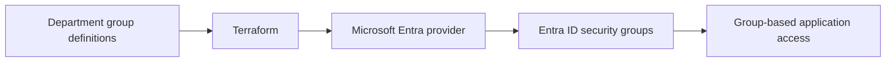

# Microsoft Entra ID Lifecycle Automation

A focused Terraform lab for managing department-based security groups in Microsoft Entra ID. It demonstrates repeatable identity administration, consistent group naming, and infrastructure-as-code validation.

## What this project demonstrates

- Declarative Entra ID security-group management
- Scalable creation with Terraform `for_each`
- Typed, documented input variables
- Credential-free pull-request formatting and validation
- A foundation for joiner, mover, and leaver automation

## Flow



## Validate locally

```bash
terraform fmt -check
terraform init
terraform validate
```

Creating or planning tenant resources requires an authenticated identity with appropriate Microsoft Graph permissions. Use least privilege and test only in a tenant you are authorized to manage.

## Next steps

- Add user input records and group assignments for joiner workflows.
- Model mover and leaver behavior with explicit approval controls.
- Add Microsoft Graph audit evidence without publishing tenant or user data.
